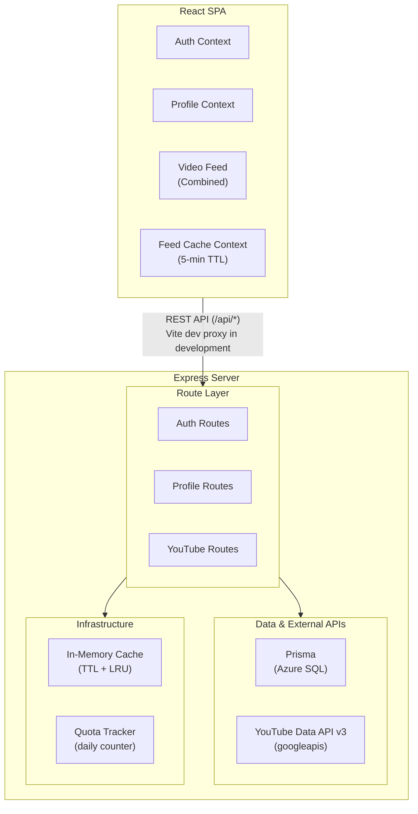
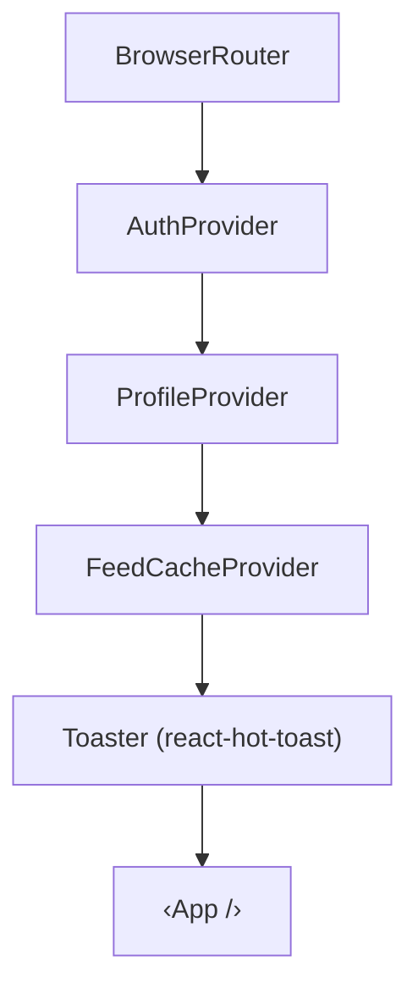
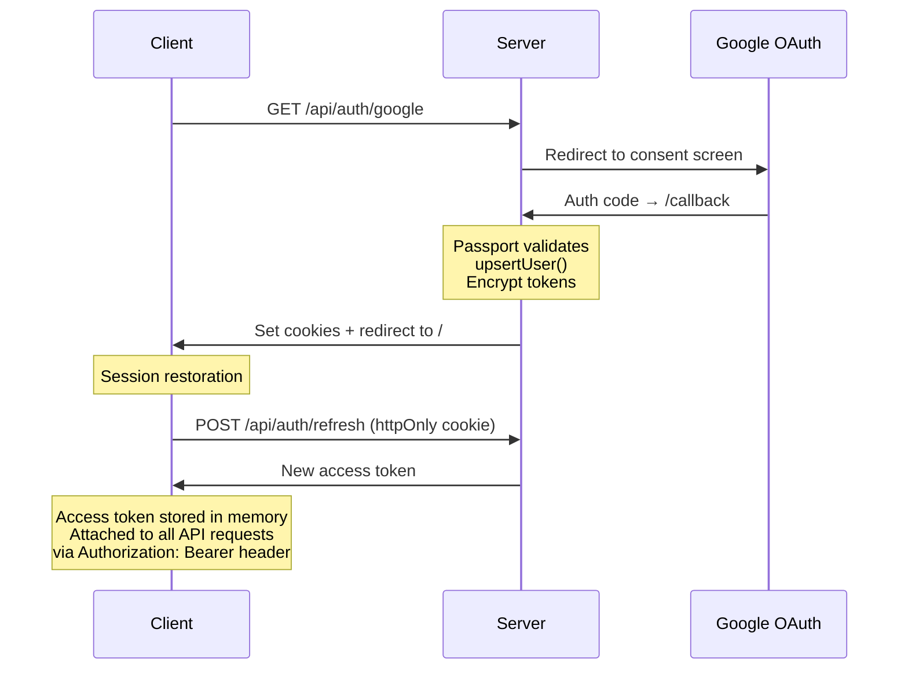
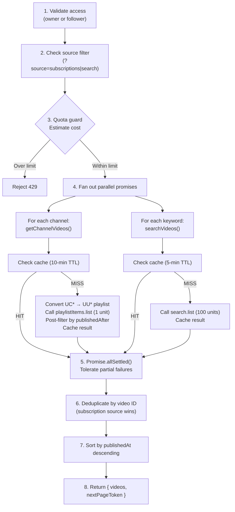
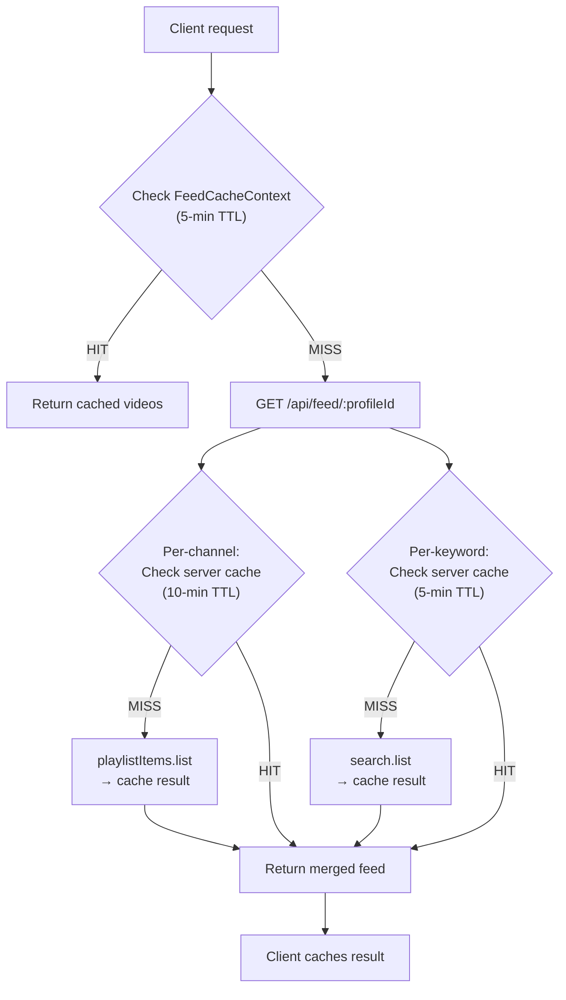
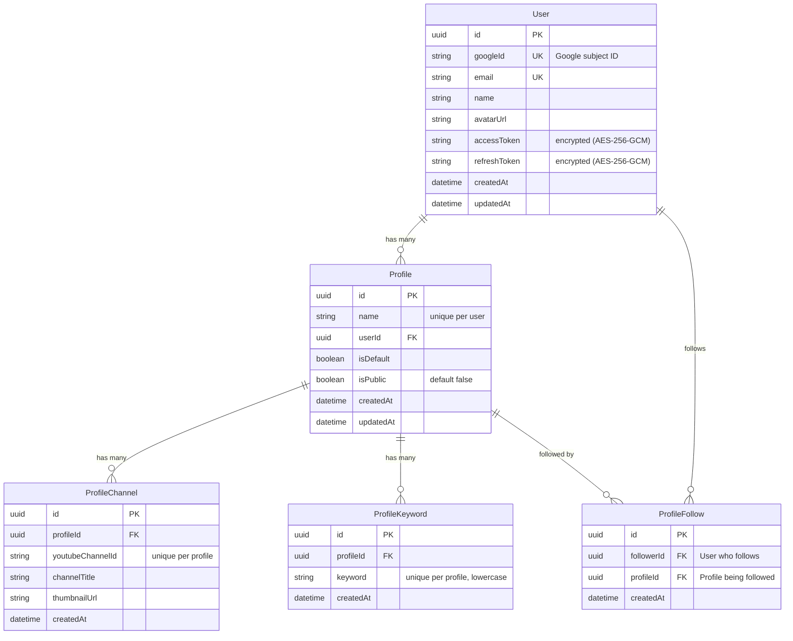
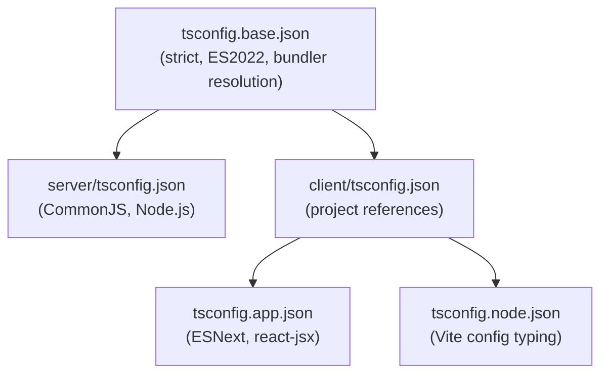
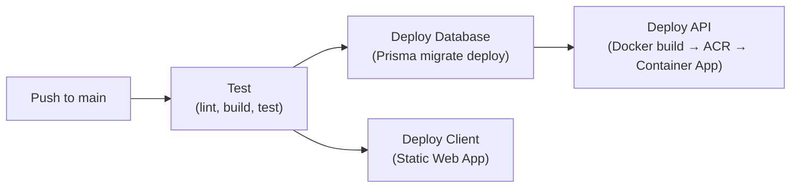

# Architecture

Technical architecture reference for the Focused Tube application — a YouTube overlay web app that lets users create curated profiles to bypass YouTube's recommendation algorithm.

For setup instructions, see [CONFIGURATION.md](CONFIGURATION.md). For a feature overview, see [README.md](README.md).

---

## Table of Contents

1. [System Overview](#1-system-overview)
2. [High-Level Architecture](#2-high-level-architecture)
3. [Server](#3-server)
4. [Client](#4-client)
5. [Authentication Flow](#5-authentication-flow)
6. [Feed Generation Pipeline](#6-feed-generation-pipeline)
7. [Caching Strategy](#7-caching-strategy)
8. [Database Schema](#8-database-schema)
9. [Security Architecture](#9-security-architecture)
10. [Error Handling](#10-error-handling)
11. [YouTube API Quota Management](#11-youtube-api-quota-management)
12. [TypeScript Configuration](#12-typescript-configuration)
13. [Key Technical Decisions](#13-key-technical-decisions)
14. [Deployment Architecture](#14-deployment-architecture)

---

## 1. System Overview

Focused Tube is an npm workspaces monorepo with two packages:

| Package | Role | Runtime |
|---------|------|---------|
| `client/` | React 18 SPA (Vite + TypeScript) | Browser |
| `server/` | Express REST API (TypeScript + Prisma) | Node.js 18+ |

Communication is via REST JSON API. The server proxies all YouTube Data API v3 calls and manages Google OAuth tokens on behalf of the user.

---

## 2. High-Level Architecture



---

## 3. Server

### 3.1 Entry Point and Middleware Chain

`server/src/index.ts` sets up Express with middleware in the following order:

1. **CORS** — restricted to `CLIENT_ORIGIN` with `credentials: true`
2. **Cookie parser** — parses httpOnly auth cookies
3. **JSON body parser** — `express.json()`
4. **Passport initialization** — OAuth strategy registration
5. **Route mounting** — five top-level route groups (see below)
6. **404 handler** — converts unmatched requests to errors
7. **Global error handler** — catches all errors, returns structured JSON

### 3.2 Route Layer

All routes are prefixed with `/api/`. Files live in `server/src/routes/`.

| File | Mount Point | Auth | Purpose |
|------|-------------|------|---------|
| `health.ts` | `/api/health` | None | Health check with quota usage |
| `auth.ts` | `/api/auth` | Mixed | Google OAuth flow, JWT token management |
| `profiles.ts` | `/api/profiles` | JWT | Profile CRUD, channel/keyword management |
| `subscriptions.ts` | `/api/subscriptions` | JWT | Fetch user's YouTube subscriptions |
| `feed.ts` | `/api/feed` | JWT | Combined video feed per profile |
| `community.ts` | `/api/community` | JWT | Public profile discovery, follow/unfollow |

#### Auth Routes

| Endpoint | Description |
|----------|-------------|
| `GET /api/auth/google` | Redirect to Google consent screen (detects new vs returning user) |
| `GET /api/auth/google/callback` | Handle OAuth callback; set three cookies and redirect to client |
| `GET /api/auth/me` | Return current user info (JWT-protected) |
| `POST /api/auth/refresh` | Rotate refresh token and issue new access token |
| `POST /api/auth/logout` | Clear all auth cookies |

**Cookies set on callback:**

| Cookie | httpOnly | Max Age | Path | Purpose |
|--------|----------|---------|------|---------|
| `ft_refresh_token` | Yes | 30 days | `/api/auth` | Long-lived session |
| `ft_access_token` | Yes | 60 seconds | `/` | Bootstrap token for client |
| `ft_returning_user` | No | 90 days | `/` | Client-side new/returning detection |

#### Profile Routes

Full CRUD for profiles plus channel and keyword management. All routes validate profile ownership via `assertProfileOwnership()`. Profile names are unique per user (1–100 characters). Keywords are normalized to lowercase. Setting `isDefault: true` atomically unsets all other profiles. The `isPublic` flag controls whether a profile is visible on the Community page.

#### Community Routes

| Endpoint | Description |
|----------|-------------|
| `GET /api/community/profiles` | List public profiles (paginated, keyword search via `?keyword=`, excludes caller's own). Returns `isFollowing` per profile. |
| `POST /api/community/profiles/:profileId/follow` | Follow a public profile (validates: exists, public, not own, not duplicate) |
| `DELETE /api/community/profiles/:profileId/follow` | Unfollow a profile |
| `GET /api/community/following` | List profiles the current user follows with owner info |

#### Feed Route

`GET /api/feed/:profileId` — accepts `?source=subscriptions|search` and `?pageToken=` query parameters. Accessible for owned profiles and for followed public profiles (using the profile owner's YouTube credentials). The pipeline is described in [section 6](#6-feed-generation-pipeline).

### 3.3 Service Layer

Business logic lives in `server/src/services/`, keeping route handlers thin.

| File | Exports | Responsibility |
|------|---------|----------------|
| `auth.service.ts` | `upsertUser()` | Create or update user with encrypted Google tokens |
| `profile.service.ts` | `assertProfileOwnership()`, custom error classes | Profile ownership validation, `NotFoundError`, `ConflictError`, `BadRequestError` |
| `community.service.ts` | `listPublicProfiles()`, `followProfile()`, `unfollowProfile()`, `listFollowedProfiles()` | Community profile discovery and follow management |
| `youtube.service.ts` | `getUserSubscriptions()`, `getChannelVideos()`, `searchVideos()` | All YouTube API interaction, token refresh, caching |

**`youtube.service.ts`** is the most complex module. Key behaviors:

- **`getChannelVideos()`** — converts channel ID (`UC*`) to uploads playlist ID (`UU*`), calls `playlistItems.list` (1 quota unit), post-filters by `publishedAfter`, and caches results
- **`searchVideos()`** — calls `search.list` (100 quota units) with keyword and `publishedAfter` filter, caches results, bypasses cache for paginated requests
- **`getUserSubscriptions()`** — paginates through all user subscriptions (50 per page)
- **Token refresh** — detects 401 responses, refreshes the Google access token, persists the new encrypted token to the database, and retries the original request
- **Error detection** — dedicated helpers for `insufficientPermissions`, `quotaExceeded`, unauthorized, and playlist-not-found errors

### 3.4 Utils

Utility modules live in `server/src/utils/`.

| File | Purpose |
|------|---------|
| `config.ts` | Centralized environment variable loading via `dotenv`. Exports a typed `config` object with defaults for all optional settings. |
| `cache.ts` | In-memory LRU cache with TTL support. Periodic sweep every 60 seconds. Configurable `maxEntries` limit (default 5000). Exported as a singleton. |
| `encryption.ts` | AES-256-GCM encryption/decryption for Google tokens at rest. Format: `<iv>:<authTag>:<ciphertext>` (all hex). |
| `jwt.ts` | Sign/verify access tokens (15-min expiry) and refresh tokens (30-day expiry) using HS256. |
| `quota.ts` | `QuotaTracker` class — records API usage, checks limits before requests, resets at midnight Pacific Time (YouTube standard). Exported as a singleton. |
| `prisma.ts` | Prisma client singleton (global in development to survive hot-reload). |

### 3.5 Passport Configuration

`server/src/config/passport.ts` registers the Google OAuth 2.0 strategy with Passport. On successful verification, it calls `upsertUser()` with the Google profile and tokens, storing the user in the database.

---

## 4. Client

### 4.1 Entry Point and Provider Stack

`client/src/main.tsx` renders the React root with providers nested in this order:



### 4.2 Routing

`client/src/App.tsx` defines the route table. Protected routes are wrapped with `ProtectedRoute`, which redirects unauthenticated users to `/login`. All page-level routes are wrapped with `ErrorBoundary`.

| Path | Page Component | Protected |
|------|----------------|-----------|
| `/login` | `LoginPage` | No |
| `/` | `Dashboard` | Yes |
| `/profiles` | `ProfilesPage` | Yes |
| `/profiles/:id/edit` | `ProfileEditPage` | Yes |
| `/profiles/:profileId/subscriptions` | `SubscriptionPickerPage` | Yes |
| `/community` | `CommunityPage` | Yes |
| `*` | Redirect to `/` | — |

### 4.3 State Management

State is managed through three React contexts in `client/src/context/`.

#### AuthContext

- Holds `user` object and `isLoading` state
- On mount, calls `POST /api/auth/refresh` to restore the session from the httpOnly refresh token cookie
- Stores the access token in memory (not localStorage) for XSS protection
- Exposes `logout()` to clear state and cookies

#### ProfileContext

- Manages `profiles[]`, `activeProfile`, and `isLoading`
- Also loads `followedProfiles[]` via `useFollowedProfiles` hook — profiles from other users that this user follows
- Active profile selection priority: localStorage key → `isDefault` profile → first profile → `null` (also checks followed profiles for saved ID)
- Provides `createProfile()`, `updateProfile()`, `deleteProfile()`, `refreshProfiles()`
- Provides `followedProfiles`, `unfollowProfile()`, `refreshFollowed()` for follow management
- Invalidates the feed cache when profiles are mutated

#### FeedCacheContext

- In-memory `Map`-based cache with 5-minute TTL per entry
- Cache key format: `${profileId}:${source ?? 'all'}`
- Exposes `get()`, `set()`, and `invalidate()` methods
- Prevents redundant network requests on tab/profile switches

### 4.4 Custom Hooks

Hooks live in `client/src/hooks/`.

| Hook | Purpose |
|------|---------|
| `useFeed(profileId, source?)` | Fetch and paginate the video feed. Checks client cache first, deduplicates videos by ID, tracks request IDs to prevent stale responses. Exposes `loadMore()` and `reset()`. |
| `useSubscriptions()` | Fetch user's YouTube subscriptions on mount with `fetchWithRetry`. Exposes `refetch()`. |
| `useProfiles()` | Re-export of `ProfileContext` consumer hook. |
| `useCommunity()` | Manages Community page state: search (debounced), pagination, profile list, optimistic follow/unfollow. |
| `useFollowedProfiles()` | Fetches profiles the user follows, provides optimistic unfollow action. Used by `ProfileContext`. |

### 4.5 API Services

All server communication goes through Axios-based functions in `client/src/services/`.

#### `api.ts` — Axios Instance

- **Request interceptor** — attaches `Authorization: Bearer <token>` header from in-memory storage
- **Response interceptor** — on 401, queues failed requests, triggers a single refresh call (`POST /api/auth/refresh`), retries all queued requests with the new token, and prevents concurrent refresh attempts
- Exports `setAccessToken()` and `getAccessToken()` for token management

#### Domain API Modules

| File | Functions |
|------|-----------|
| `feedApi.ts` | `fetchFeed(profileId, params?)` — wraps with `fetchWithRetry` |
| `profilesApi.ts` | `fetchProfiles()`, `fetchProfile()`, `createProfile()`, `updateProfile()`, `deleteProfile()`, `addChannel()`, `removeChannel()`, `addKeyword()`, `removeKeyword()` |
| `subscriptionsApi.ts` | `fetchSubscriptions()` — wraps with `fetchWithRetry` |
| `communityApi.ts` | `fetchCommunityProfiles(params?)`, `followProfile()`, `unfollowProfile()`, `fetchFollowedProfiles()` |

### 4.6 Utility Libraries

`client/src/lib/` contains shared utilities:

| File | Purpose |
|------|---------|
| `fetchWithRetry.ts` | Retries failed API calls with exponential backoff (base 100 ms, max 3 retries). Skips retries for 4xx client errors. |
| `toast.ts` | Wraps `react-hot-toast` with `notify.success()`, `notify.error()`, and `notify.info()` helpers (5-second duration). |

### 4.7 Component Organization

Components in `client/src/components/` are organized by domain:

```
components/
├── auth/
│   └── ProtectedRoute.tsx          # Route guard, redirects to /login
├── feed/
│   ├── FeedSourceTabs.tsx          # All / Subscriptions / Search tabs
│   ├── VideoCard.tsx               # Individual video display (button + YouTube link)
│   ├── VideoCardSkeleton.tsx       # Loading placeholder
│   ├── VideoFeed.tsx               # Video list + infinite scroll
│   ├── VideoPlayer.tsx             # Sticky in-app YouTube iframe player
│   └── VideoPlayer.css             # Player styles (sticky, responsive, a11y)
├── profile/
│   ├── ProfileSwitcher.tsx         # Profile selector dropdown (owned + followed)
│   └── ProfileSwitcherSkeleton.tsx # Loading skeleton
├── subscriptions/
│   ├── SubscriptionChannelRow.tsx  # Single subscription item
│   └── SubscriptionItemSkeleton.tsx# Loading skeleton
└── ui/
    ├── AppHeader.tsx               # Top navigation bar with Community link
    ├── ErrorBoundary.tsx           # React error boundary with fallback
    ├── SettingsMenu.tsx            # User menu (logout, etc.)
    └── Skeleton.tsx                # Generic skeleton loader
```

### 4.8 Vite Configuration

`client/vite.config.ts` configures:

- **React plugin** — JSX/TSX support via `@vitejs/plugin-react`
- **Dev proxy** — `/api/*` requests are proxied to `http://localhost:3001`, allowing the client to use relative URLs

---

## 5. Authentication Flow



**Token lifecycle:**

| Token | Storage | Lifetime | Renewal |
|-------|---------|----------|---------|
| Google access token | Database (encrypted) | ~1 hour | Auto-refreshed by server on 401 from YouTube |
| Google refresh token | Database (encrypted) | Long-lived | Obtained on first consent |
| JWT access token | Client memory | 15 minutes | Refreshed via `/api/auth/refresh` |
| JWT refresh token | httpOnly cookie | 30 days | Rotated on each refresh call |

**Returning user optimization:** The `ft_returning_user` cookie (non-httpOnly, 90 days) lets the client detect returning users and skip the consent screen prompt by omitting `prompt: 'consent'` and `accessType: 'offline'` from the OAuth request.

---

## 6. Feed Generation Pipeline

When the client requests `GET /api/feed/:profileId`:



Key design choices:
- `playlistItems.list` costs 1 quota unit vs 100 for `search.list` — a 99% reduction for channel videos
- `Promise.allSettled()` ensures partial results are returned even if some API calls fail
- Videos from subscriptions take priority over search results during deduplication
- Videos are filtered to the last 14 days (configurable via `FEED_PUBLISHED_AFTER_DAYS`)

---

## 7. Caching Strategy

### Server-Side Cache

An in-memory LRU cache (`server/src/utils/cache.ts`) with TTL support:

| Data | TTL | Quota Cost |
|------|-----|------------|
| Channel videos (`playlistItems.list`) | 10 minutes | 1 unit/call |
| Keyword search results (`search.list`) | 5 minutes | 100 units/call |

- Maximum 5000 entries (configurable via `CACHE_MAX_ENTRIES`)
- LRU eviction when limit is reached
- Automatic expired-entry sweep every 60 seconds
- Paginated requests bypass the cache to avoid stale continuation tokens

### Client-Side Cache

A React context (`FeedCacheContext`) backed by an in-memory `Map`:

- **TTL:** 5 minutes per entry
- **Key format:** `${profileId}:${source ?? 'all'}`
- **Invalidation:** triggered on profile update or deletion
- **Purpose:** prevents redundant network requests on tab switches and profile toggling

### Cache Flow



---

## 8. Database Schema

SQLite via Prisma ORM. Schema at `server/src/prisma/schema.prisma`.



**Cascade deletes:** Deleting a User cascades to Profiles; deleting a Profile cascades to its Channels, Keywords, and Follows. The ProfileFollow→User (follower) relation uses `NoAction` to avoid cyclic cascade paths.

---

## 9. Security Architecture

| Layer | Mechanism | Details |
|-------|-----------|---------|
| **Authentication** | Google OAuth 2.0 + JWT | Passport strategy; JWT access + refresh token pair |
| **Authorization** | Profile ownership + follow checks | `assertProfileOwnership()` on profile routes; feed allows owners and followers of public profiles |
| **Token storage (server)** | AES-256-GCM encryption | Google tokens encrypted at rest with random IV and auth tag |
| **Token storage (client)** | In-memory only | Access token never stored in localStorage or cookies by the client |
| **Session cookies** | httpOnly, path-scoped | Refresh token cookie scoped to `/api/auth`; inaccessible to JavaScript |
| **CORS** | Origin allowlist | Only `CLIENT_ORIGIN` allowed; `credentials: true` |
| **XSS protection** | httpOnly cookies | JavaScript cannot read the refresh token |
| **CSRF protection** | Bearer token in header | Access token sent via `Authorization` header, not auto-attached cookies |

---

## 10. Error Handling

### Server

- **Custom error classes** — `NotFoundError` (404), `ConflictError` (409), `BadRequestError` (400) in `profile.service.ts`
- **Global error middleware** — logs the stack trace, returns `{ error: message }` with appropriate HTTP status
- **YouTube API errors** — 401 triggers automatic token refresh and retry; 403 `quotaExceeded` returns 429; 403 `insufficientPermissions` returns 403 with re-auth instructions
- **Prisma constraint errors** — unique constraint violations (P2002) are caught and converted to 409 Conflict

### Client

- **`ErrorBoundary`** — wraps every page-level route; renders a fallback UI on unhandled React errors
- **`fetchWithRetry`** — exponential backoff (100 ms base, max 3 retries) for network and 5xx errors; 4xx errors are not retried
- **401 interceptor** — the Axios response interceptor queues failed requests during token refresh and retries them with a new access token; only one refresh attempt runs at a time
- **Toast notifications** — user-facing errors surface via `react-hot-toast`
- **Stale response tracking** — `useFeed` assigns request IDs to prevent out-of-order responses from overwriting newer data

---

## 11. YouTube API Quota Management

The YouTube Data API v3 has a **10,000 unit daily quota**. Focused Tube manages this through several layers:

| Layer | Strategy | Impact |
|-------|----------|--------|
| **API choice** | `playlistItems.list` for channel videos | 1 unit vs 100 units — 99% reduction |
| **Server cache** | LRU + TTL for all YouTube responses | Eliminates duplicate API calls within TTL window |
| **Client cache** | 5-minute feed cache per profile | Prevents redundant server requests |
| **Pre-request guard** | Estimate cost before API calls | Rejects feed requests that would exceed the soft limit |
| **Daily tracking** | `QuotaTracker` singleton | Records every API call, resets at midnight Pacific Time |
| **Health endpoint** | `GET /api/health` | Exposes real-time quota usage for monitoring |

**Quota costs:**

| YouTube API Method | Cost per Call |
|--------------------|---------------|
| `playlistItems.list` | 1 unit |
| `channels.list` | 1 unit |
| `subscriptions.list` | 1 unit |
| `search.list` | 100 units |

The soft limit defaults to 9,000 units (configurable via `QUOTA_DAILY_LIMIT`), leaving a 1,000-unit buffer below the hard cap.

---

## 12. TypeScript Configuration

The project uses a shared base configuration with workspace-specific overrides:



**Base config highlights:** `strict: true`, `target: ES2022`, `moduleResolution: bundler`, `esModuleInterop: true`, `skipLibCheck: true`.

**Server override:** `module: CommonJS`, `outDir: dist/`, `rootDir: src/`.

**Client override:** `jsx: react-jsx`, includes `src/`.

---

## 13. Key Technical Decisions

| Decision | Rationale |
|----------|-----------|
| **Monorepo with npm workspaces** | Single repo with shared TypeScript config; simple dependency management |
| **SQLite + Prisma** | Zero-config local database; type-safe queries; easy migrations |
| **In-memory cache (not Redis)** | No external dependencies; sufficient for single-server deployment |
| **httpOnly cookies for refresh tokens** | XSS protection — JavaScript cannot access the token |
| **Access token in memory (not localStorage)** | Combined with Bearer header, prevents both XSS and CSRF attacks |
| **AES-256-GCM for stored tokens** | Authenticated encryption protects Google credentials at rest |
| **`playlistItems.list` over `search.list` for channels** | 1 quota unit vs 100 — enables ~100x more channel fetches per day |
| **`Promise.allSettled()` for feed assembly** | Partial failures don't block the entire feed; users see available results |
| **Exponential backoff with `fetchWithRetry`** | Resilience against transient network failures without overwhelming the server |
| **Request ID tracking in `useFeed`** | Prevents stale responses from overwriting newer data during rapid navigation |
| **Vite dev proxy** | Client uses relative `/api/*` URLs; no CORS complexity in development |
| **Spec-driven development workflow** | Feature specs and user stories in `specs/` ensure deliberate design before implementation |

---

## 14. Deployment Architecture

The application deploys to Azure via a GitHub Actions CI/CD pipeline. See [DEPLOYMENT.md](DEPLOYMENT.md) for step-by-step setup.

### Infrastructure

| Component | Azure Service | Purpose |
|-----------|--------------|----------|
| **Frontend** | Azure Static Web App | Global CDN for the React SPA |
| **Backend API** | Azure Container App | Runs the Express API as a Docker container |
| **Container Images** | Azure Container Registry (ACR) | Stores versioned server Docker images |
| **Database** | Azure SQL | Persistent relational storage (Prisma ORM) |

### CI/CD Pipeline



- **On pull requests:** runs tests only (no deployment)
- **On push to `main`:** runs tests, then deploys database, client (parallel with database), and API (after database)
- **OIDC authentication:** GitHub Actions authenticates to Azure via federated credentials — no long-lived secrets
- **Immutable image tags:** every deployment uses the Git commit SHA as the image tag for traceability

### Server Dockerfile

The server uses a multi-stage Docker build (`server/Dockerfile`):

1. **Builder stage** — installs all dependencies, generates Prisma client, compiles TypeScript
2. **Runtime stage** — installs production dependencies only, copies compiled output, runs as non-root user
