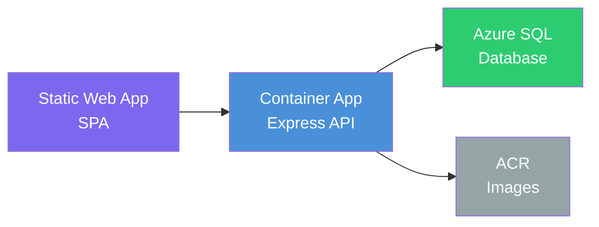

# Deployment Guide

Step-by-step instructions for deploying Focused Tube to Azure. This guide assumes the Azure infrastructure is already provisioned.

---

## Table of Contents

1. [Infrastructure Overview](#1-infrastructure-overview)
2. [Prerequisites](#2-prerequisites)
3. [Configure Azure Container Registry](#3-configure-azure-container-registry)
4. [Configure OIDC Authentication for GitHub Actions](#4-configure-oidc-authentication-for-github-actions)
5. [Configure GitHub Secrets and Variables](#5-configure-github-secrets-and-variables)
6. [Configure Azure SQL](#6-configure-azure-sql)
7. [Configure the Container App](#7-configure-the-container-app)
8. [Configure the Static Web App](#8-configure-the-static-web-app)
9. [Deploy](#9-deploy)
10. [Post-Deployment Verification](#10-post-deployment-verification)
11. [Rollback Procedures](#11-rollback-procedures)
12. [Troubleshooting](#12-troubleshooting)

---

## 1. Infrastructure Overview

| Component | Azure Service | Purpose |
|-----------|--------------|---------|
| **Frontend** | Azure Static Web App | Serves the React SPA with global CDN |
| **Backend API** | Azure Container App | Runs the Express API as a Docker container |
| **Container Registry** | Azure Container Registry (ACR) | Stores the server Docker images |
| **Database** | Azure SQL | Persistent data store (Users, Profiles, Channels, Keywords) |



---

## 2. Prerequisites

Before configuring the CI/CD pipeline, ensure:

| Requirement | Description |
|-------------|-------------|
| **Azure subscription** | Active subscription with Owner or Contributor access |
| **Azure CLI** | Installed and authenticated (`az login`) |
| **GitHub repository** | This repo pushed to GitHub with Actions enabled |
| **Provisioned infrastructure** | Static Web App, Container App, ACR, and Azure SQL already created |

Verify your Azure CLI is authenticated:

```bash
az account show --query "{subscription: name, id: id}" -o table
```

---

## 3. Configure Azure Container Registry

The server Docker image is pushed to ACR. Enable the admin account to provide credentials for GitHub Actions:

```bash
# Enable admin access on ACR (if not already)
az acr update --name <ACR_NAME> --admin-enabled true

# Retrieve the login server, username, and password
az acr credential show --name <ACR_NAME> --query "{loginServer: '<ACR_NAME>.azurecr.io', username: username, password: passwords[0].value}" -o table
```

Record these values — they are used as GitHub secrets/variables in [Step 5](#5-configure-github-secrets-and-variables).

> **Alternative (recommended for production):** Instead of admin credentials, configure ACR with a service principal or managed identity. See [ACR authentication options](https://learn.microsoft.com/en-us/azure/container-registry/container-registry-authentication).

---

## 4. Configure OIDC Authentication for GitHub Actions

OIDC eliminates long-lived Azure credentials. Create a Microsoft Entra ID app registration with federated credentials for GitHub Actions.

### 4.1 Create the app registration

```bash
# Create the app registration
az ad app create --display-name "focused-tube-github-actions"

# Note the appId from the output
APP_ID=$(az ad app list --display-name "focused-tube-github-actions" --query "[0].appId" -o tsv)

# Create a service principal
az ad sp create --id $APP_ID

# Get the object ID of the service principal
SP_OBJECT_ID=$(az ad sp show --id $APP_ID --query "id" -o tsv)
```

### 4.2 Assign roles

Grant the service principal the minimum permissions needed:

```bash
SUBSCRIPTION_ID=$(az account show --query "id" -o tsv)
RESOURCE_GROUP="<YOUR_RESOURCE_GROUP>"

# Contributor on the resource group (for Container App and ACR operations)
az role assignment create \
  --assignee-object-id $SP_OBJECT_ID \
  --assignee-principal-type ServicePrincipal \
  --role "Contributor" \
  --scope "/subscriptions/$SUBSCRIPTION_ID/resourceGroups/$RESOURCE_GROUP"
```

### 4.3 Add federated credentials

Create a federated credential for the `main` branch:

```bash
az ad app federated-credential create --id $APP_ID --parameters '{
  "name": "focused-tube-main",
  "issuer": "https://token.actions.githubusercontent.com",
  "subject": "repo:<GITHUB_ORG>/<GITHUB_REPO>:ref:refs/heads/main",
  "audiences": ["api://AzureADTokenExchange"]
}'
```

Record these values for [Step 5](#5-configure-github-secrets-and-variables):

```bash
echo "AZURE_CLIENT_ID: $APP_ID"
echo "AZURE_TENANT_ID: $(az account show --query 'tenantId' -o tsv)"
echo "AZURE_SUBSCRIPTION_ID: $SUBSCRIPTION_ID"
```

---

## 5. Configure GitHub Secrets and Variables

Navigate to your GitHub repository → **Settings → Secrets and variables → Actions**.

### Secrets (sensitive values)

| Secret Name | Value | Source |
|-------------|-------|--------|
| `AZURE_CLIENT_ID` | App registration Application (client) ID | [Step 4.3](#43-add-federated-credentials) |
| `AZURE_TENANT_ID` | Microsoft Entra tenant ID | [Step 4.3](#43-add-federated-credentials) |
| `AZURE_SUBSCRIPTION_ID` | Azure subscription ID | [Step 4.3](#43-add-federated-credentials) |
| `ACR_USERNAME` | ACR admin username | [Step 3](#3-configure-azure-container-registry) |
| `ACR_PASSWORD` | ACR admin password | [Step 3](#3-configure-azure-container-registry) |
| `DATABASE_URL` | Azure SQL connection string | [Step 6](#6-configure-azure-sql) |
| `SWA_DEPLOYMENT_TOKEN` | Static Web App deployment token | [Step 8](#8-configure-the-static-web-app) |

### Variables (non-sensitive configuration)

| Variable Name | Value | Example |
|---------------|-------|---------|
| `ACR_LOGIN_SERVER` | ACR login server hostname | `myregistry.azurecr.io` |
| `AZURE_RESOURCE_GROUP` | Resource group name | `rg-focused-tube` |
| `CONTAINER_APP_NAME` | Container App name | `ca-focused-tube-api` |
| `CONTAINER_APP_FQDN` | Container App base URL (no trailing slash) | `https://ca-focused-tube-api.example.eastus.azurecontainerapps.io` |

### Create a GitHub environment

Create a `production` environment with optional protection rules:

1. Go to **Settings → Environments → New environment**
2. Name it `production`
3. (Optional) Add required reviewers for deployment approvals
4. (Optional) Restrict to the `main` branch only

---

## 6. Configure Azure SQL

### 6.1 Get the connection string

```bash
# Get the server FQDN
az sql server show --name <SQL_SERVER_NAME> --resource-group <RESOURCE_GROUP> --query "fullyQualifiedDomainName" -o tsv
```

The `DATABASE_URL` follows the Prisma SQL Server format:

```
sqlserver://<SERVER_FQDN>:1433;database=<DATABASE_NAME>;user=<USERNAME>;password=<PASSWORD>;encrypt=true;trustServerCertificate=false
```

### 6.2 Allow GitHub Actions access

For the migration job to connect to Azure SQL, allow Azure services or add a firewall rule:

```bash
# Option A: Allow Azure services (simpler, broader)
az sql server firewall-rule create \
  --resource-group <RESOURCE_GROUP> \
  --server <SQL_SERVER_NAME> \
  --name AllowAzureServices \
  --start-ip-address 0.0.0.0 \
  --end-ip-address 0.0.0.0

# Option B: Allow GitHub Actions IP ranges (tighter, requires periodic updates)
# See https://api.github.com/meta for current IP ranges
```

### 6.3 Run the initial migration manually

For the very first deployment, run the migration from your local machine:

```bash
cd server
DATABASE_URL="sqlserver://<SERVER_FQDN>:1433;database=<DB>;user=<USER>;password=<PASS>;encrypt=true" \
  npx prisma migrate deploy
```

Subsequent migrations are applied automatically by the CI/CD pipeline.

---

## 7. Configure the Container App

### 7.1 Set environment variables

Configure the Container App with all required environment variables:

```bash
az containerapp update \
  --name <CONTAINER_APP_NAME> \
  --resource-group <RESOURCE_GROUP> \
  --set-env-vars \
    "PORT=3001" \
    "NODE_ENV=production" \
    "CLIENT_ORIGIN=https://<SWA_HOSTNAME>" \
    "DATABASE_URL=secretref:database-url" \
    "GOOGLE_CLIENT_ID=secretref:google-client-id" \
    "GOOGLE_CLIENT_SECRET=secretref:google-client-secret" \
    "GOOGLE_CALLBACK_URL=https://<CONTAINER_APP_FQDN>/api/auth/google/callback" \
    "JWT_SECRET=secretref:jwt-secret" \
    "JWT_REFRESH_SECRET=secretref:jwt-refresh-secret" \
    "ENCRYPTION_KEY=secretref:encryption-key"
```

### 7.2 Configure secrets in Container App

Store sensitive values as Container App secrets:

```bash
az containerapp secret set \
  --name <CONTAINER_APP_NAME> \
  --resource-group <RESOURCE_GROUP> \
  --secrets \
    "database-url=<DATABASE_URL>" \
    "google-client-id=<GOOGLE_CLIENT_ID>" \
    "google-client-secret=<GOOGLE_CLIENT_SECRET>" \
    "jwt-secret=<JWT_SECRET>" \
    "jwt-refresh-secret=<JWT_REFRESH_SECRET>" \
    "encryption-key=<ENCRYPTION_KEY>"
```

### 7.3 Configure ACR image pull

Allow the Container App to pull images from ACR:

```bash
az containerapp registry set \
  --name <CONTAINER_APP_NAME> \
  --resource-group <RESOURCE_GROUP> \
  --server <ACR_LOGIN_SERVER> \
  --username <ACR_USERNAME> \
  --password <ACR_PASSWORD>
```

### 7.4 Configure ingress

Ensure the Container App has external ingress on port 3001:

```bash
az containerapp ingress enable \
  --name <CONTAINER_APP_NAME> \
  --resource-group <RESOURCE_GROUP> \
  --target-port 3001 \
  --type external
```

---

## 8. Configure the Static Web App

### 8.1 Get the deployment token

```bash
az staticwebapp secrets list \
  --name <SWA_NAME> \
  --resource-group <RESOURCE_GROUP> \
  --query "properties.apiKey" -o tsv
```

Save this as the `SWA_DEPLOYMENT_TOKEN` GitHub secret ([Step 5](#5-configure-github-secrets-and-variables)).

### 8.2 Update Google OAuth redirect URIs

In the [Google Cloud Console](https://console.cloud.google.com/) → **APIs & Services → Credentials**, update your OAuth client:

1. Under **Authorized JavaScript origins**, add the Static Web App URL:

   ```
   https://<SWA_HOSTNAME>
   ```

2. Under **Authorized redirect URIs**, add:

   ```
   https://<CONTAINER_APP_FQDN>/api/auth/google/callback
   ```

---

## 9. Deploy

### Automatic deployment (recommended)

Push to `main` to trigger the CI/CD pipeline:

```bash
git push origin main
```

The pipeline runs in this order:

1. **Test** — install, build, and test both workspaces
2. **Deploy Database** — run Prisma migrations against Azure SQL (after tests pass)
3. **Deploy Client** — build and deploy the SPA to Static Web App (after tests pass, parallel with database)
4. **Deploy API** — build Docker image, push to ACR, update Container App (after tests and database migration)

### Monitor the deployment

Track progress at: `https://github.com/<OWNER>/<REPO>/actions`

### Manual deployment (first time or emergency)

If needed, you can deploy manually:

```bash
# 1. Build and push the Docker image
docker build -t <ACR_LOGIN_SERVER>/focused-tube-api:manual -f server/Dockerfile .
docker push <ACR_LOGIN_SERVER>/focused-tube-api:manual

# 2. Update the Container App
az containerapp update \
  --name <CONTAINER_APP_NAME> \
  --resource-group <RESOURCE_GROUP> \
  --image <ACR_LOGIN_SERVER>/focused-tube-api:manual

# 3. Run migrations
cd server
DATABASE_URL="<AZURE_SQL_CONNECTION_STRING>" npx prisma migrate deploy

# 4. Deploy the client
cd ../client
npm run build
az staticwebapp deploy \
  --name <SWA_NAME> \
  --resource-group <RESOURCE_GROUP> \
  --app-location dist
```

---

## 10. Post-Deployment Verification

After a successful deployment, verify each component:

### Health check

```bash
curl https://<CONTAINER_APP_FQDN>/api/health
# Expected: { "status": "ok", "quota": { ... } }
```

### Client

Open `https://<SWA_HOSTNAME>` in a browser. Confirm the login page loads and the SPA routes work.

### Authentication

Click **Sign in with Google** and complete the OAuth flow. Verify you are redirected back and authenticated.

### Database

```bash
# Verify migration status
cd server
DATABASE_URL="<AZURE_SQL_CONNECTION_STRING>" npx prisma migrate status
```

---

## 11. Rollback Procedures

### Roll back the API

Deploy the previous image revision:

```bash
# List recent revisions
az containerapp revision list \
  --name <CONTAINER_APP_NAME> \
  --resource-group <RESOURCE_GROUP> \
  --query "[].{name:name, active:properties.active, created:properties.createdTime}" -o table

# Activate a previous revision
az containerapp revision activate \
  --name <CONTAINER_APP_NAME> \
  --resource-group <RESOURCE_GROUP> \
  --revision <PREVIOUS_REVISION_NAME>

# Route all traffic to the previous revision
az containerapp ingress traffic set \
  --name <CONTAINER_APP_NAME> \
  --resource-group <RESOURCE_GROUP> \
  --revision-weight <PREVIOUS_REVISION_NAME>=100
```

### Roll back the client

Re-run the deploy-client job from a previous successful workflow run in GitHub Actions.

### Roll back database migrations

> **Warning:** Prisma does not support automatic down migrations for SQL Server. Test migrations thoroughly in a staging environment before deploying to production. If a rollback is necessary, write and apply a corrective migration manually.

---

## 12. Troubleshooting

### Container App not starting

```bash
# Check logs
az containerapp logs show \
  --name <CONTAINER_APP_NAME> \
  --resource-group <RESOURCE_GROUP> \
  --follow

# Check revision status
az containerapp revision show \
  --name <CONTAINER_APP_NAME> \
  --resource-group <RESOURCE_GROUP> \
  --revision <REVISION_NAME>
```

### Database connection failures

- Verify the `DATABASE_URL` secret in the Container App matches the Azure SQL connection string
- Confirm the Azure SQL firewall allows the Container App's outbound IPs
- Check that the database user has the correct permissions

### Static Web App not updating

- Verify the `SWA_DEPLOYMENT_TOKEN` secret is correct
- Check the GitHub Actions logs for the `deploy-client` job
- The SWA configuration in `client/public/staticwebapp.config.json` controls routing fallback

### ACR image pull failures

```bash
# Verify ACR credentials
az acr login --name <ACR_NAME>
docker pull <ACR_LOGIN_SERVER>/focused-tube-api:latest

# Verify Container App registry configuration
az containerapp registry show \
  --name <CONTAINER_APP_NAME> \
  --resource-group <RESOURCE_GROUP> \
  --server <ACR_LOGIN_SERVER>
```

### OAuth redirect errors in production

- Ensure `CLIENT_ORIGIN` on the Container App matches the Static Web App URL exactly (including `https://`)
- Ensure `GOOGLE_CALLBACK_URL` uses the Container App FQDN
- Verify both URLs are added to the Google OAuth client in the Cloud Console
