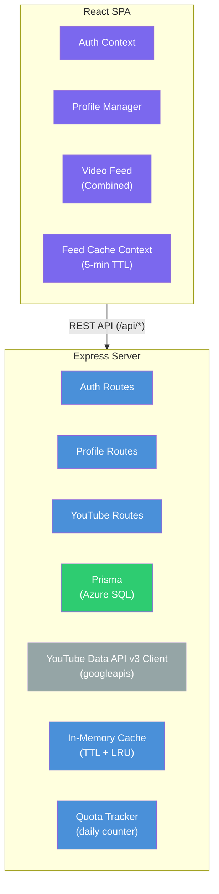

# Focused Tube

A YouTube overlay web app that lets users create curated profiles, each with subscribed channels and keywords, to bypass YouTube's recommendation algorithm. Users sign in with Google to import their YouTube subscriptions, organize them into private or public profiles, follow public profiles from the community, and view a combined feed of subscription-based and keyword-search videos.

---

## Key Features

- **Google OAuth sign-in** — authenticate with your Google account and import your YouTube subscriptions
- **Profile-based curation** — create multiple named profiles, each with its own set of channels and keywords
- **Community profiles** — make profiles public, discover public profiles, and follow or unfollow profiles from other users
- **Combined video feed** — view a deduplicated, date-sorted feed combining subscription uploads and keyword search results
- **Source tagging** — every video is tagged as `"subscription"` or `"search"` so you know where it came from
- **In-app video player** — click a video card to watch inline via a sticky YouTube embed without leaving the app; Escape or close button dismisses the player and restores focus
- **Feed filtering** — filter the feed by source (`?source=subscriptions` or `?source=search`)
- **Subscription picker** — browse and search your YouTube subscriptions to add channels to a profile
- **Keyword management** — tag-style input for adding/removing keywords per profile
- **Error boundaries & toast notifications** — graceful error handling with retry logic throughout
- **API caching** — server-side in-memory cache (TTL + LRU) and client-side React context cache to minimize YouTube API calls
- **Quota management** — real-time quota tracking, soft-limit guard, and usage visible on the health endpoint
- **Smart OAuth** — returning users skip the Google consent screen automatically

---

## Technology Stack

| Layer | Technology | Version |
|-------|-----------|---------|
| **Runtime** | Node.js | 22+ locally, 24 in CI |
| **Frontend** | React (SPA) | 18.3 |
| **Build tool** | Vite | 6 |
| **Language** | TypeScript | 5.7 |
| **Backend** | Express | 4 |
| **ORM** | Prisma | 6 |
| **Database** | Azure SQL / SQL Server | — |
| **Auth** | Google OAuth 2.0 + Passport | — |
| **Sessions** | JWT (access + refresh tokens) | — |
| **YouTube API** | YouTube Data API v3 via `googleapis` | — |
| **HTTP client** | Axios | 1.14 |
| **Routing** | React Router | 7 |
| **Testing** | Vitest + Testing Library | 4 / 16 |

---

## Architecture

Monorepo with two npm workspaces:

- **`client/`** — React 18 SPA built with Vite and TypeScript
- **`server/`** — Express REST API in TypeScript, with Prisma ORM over Azure SQL (SQL Server)

Communication is via REST JSON API. The server proxies all YouTube Data API v3 calls.



### Data flow

1. User authenticates via Google OAuth → server stores encrypted access/refresh tokens
2. User creates profiles with channels (from their YouTube subscriptions) and keywords
3. Feed endpoint combines two sources per profile:
   - **Subscription feed** — recent uploads from profile channels via `playlistItems.list` (1 unit/call)
   - **Keyword search feed** — results for each keyword via `search.list` (100 units/call)
4. Both sources are checked against the server-side cache before making API calls
5. Videos are deduplicated by ID, sorted by date, filtered to the last 14 days (configurable), and tagged with their source
6. Client-side cache prevents redundant network requests for recently fetched feeds

---

## Project Structure

```
focused-tube/
├── client/                    # React SPA (Vite + TypeScript)
│   ├── src/
│   │   ├── components/
│   │   │   ├── auth/          # LoginButton, ProtectedRoute
│   │   │   ├── feed/          # VideoFeed, VideoCard
│   │   │   ├── profile/       # ProfileSwitcher, ProfileEditor
│   │   │   ├── subscriptions/ # SubscriptionPicker
│   │   │   └── ui/            # Shared UI (ErrorBoundary, etc.)
│   │   ├── context/           # AuthContext, ProfileContext, FeedCacheContext
│   │   ├── hooks/             # useAuth, useProfiles, useFeed, useSubscriptions
│   │   ├── pages/             # LoginPage, Dashboard, ProfileEditPage, etc.
│   │   ├── services/          # API client functions (api, feedApi, profilesApi, etc.)
│   │   ├── types/             # TypeScript interfaces
│   │   └── App.tsx
│   └── package.json
├── server/                    # Express REST API (TypeScript)
│   ├── src/
│   │   ├── routes/            # auth, profiles, feed, subscriptions, community, health
│   │   ├── middleware/        # auth, cors, errorHandler, notFound
│   │   ├── services/          # auth.service, profile.service, youtube.service
│   │   ├── prisma/            # schema.prisma + migrations
│   │   ├── utils/             # jwt, encryption, config, cache, quota
│   │   ├── types/             # express.d.ts
│   │   └── index.ts           # Express app entry point
│   └── package.json
├── specs/                     # Feature specs and user stories
├── package.json               # Root workspace config
├── tsconfig.base.json         # Shared TypeScript config
└── CONFIGURATION.md           # Full setup guide
```

---

## Getting Started

### Prerequisites

| Tool | Minimum Version | Check |
|------|-----------------|-------|
| Node.js | 22+ | `node --version` |
| npm | 9+ | `npm --version` |
| Git | Any recent | `git --version` |

You also need a **Google Cloud project** with OAuth 2.0 credentials and the YouTube Data API v3 enabled. See [CONFIGURATION.md](CONFIGURATION.md) for the full step-by-step walkthrough.

### Quick start

```bash
# 1. Clone the repo
git clone https://github.com/ricardocovo/focused-tube.git
cd focused-tube

# 2. Install dependencies (both workspaces)
npm install

# 3. Create .env in the project root (see Environment Variables below)
cp .env.example .env
# Fill in your Google OAuth credentials and generated secrets

# 4. Set up the database (requires SQL Server; use Docker for local dev)
# docker run -e "ACCEPT_EULA=Y" -e "SA_PASSWORD=YourStrong@Passw0rd" -p 1433:1433 -d mcr.microsoft.com/mssql/server:2022-latest
cd server
npx prisma generate
npx prisma migrate dev
cd ..

# 5. Start development
npm run dev
```

This launches both services concurrently:

| Service | URL |
|---------|-----|
| Client (Vite) | http://localhost:5173 |
| Server (Express) | http://localhost:3001 |

### Verify

```bash
curl http://localhost:3001/api/health
# → { "status": "ok", "quota": { "date": "...", "used": 0, "limit": 9000, "remaining": 9000 } }
```

Open http://localhost:5173 and click **Sign in with Google**.

---

## Environment Variables

Create a `.env` file in the project root:

| Variable | Required | Default | Description |
|----------|----------|---------|-------------|
| `PORT` | No | `3001` | Express server port |
| `NODE_ENV` | No | `development` | `development` or `production` |
| `CLIENT_ORIGIN` | No | `http://localhost:5173` | Frontend URL for CORS |
| `DATABASE_URL` | **Yes** | — | SQL Server connection string (see `.env.example`) |
| `SHADOW_DATABASE_URL` | **Yes for migrations** | — | SQL Server shadow database connection string for Prisma migrations |
| `GOOGLE_CLIENT_ID` | **Yes** | — | OAuth 2.0 Client ID |
| `GOOGLE_CLIENT_SECRET` | **Yes** | — | OAuth 2.0 Client Secret |
| `GOOGLE_CALLBACK_URL` | No | `http://localhost:3001/api/auth/google/callback` | OAuth redirect URI |
| `JWT_SECRET` | **Yes** | — | Secret for access tokens (32+ chars) |
| `JWT_REFRESH_SECRET` | **Yes** | — | Secret for refresh tokens (different from JWT_SECRET) |
| `ENCRYPTION_KEY` | **Yes** | — | 64-char hex string for AES-256-GCM encryption |
| `CACHE_MAX_ENTRIES` | No | `5000` | Maximum entries in the server-side in-memory cache |
| `CACHE_TTL_CHANNEL_SECONDS` | No | `600` | TTL for cached channel upload results (seconds) |
| `CACHE_TTL_KEYWORD_SECONDS` | No | `300` | TTL for cached keyword search results (seconds) |
| `FEED_PUBLISHED_AFTER_DAYS` | No | `14` | Only return videos published within this many days |
| `QUOTA_DAILY_LIMIT` | No | `9000` | Soft quota guard threshold (YouTube limit is 10,000) |

Generate secrets with:

```bash
node -e "console.log(require('crypto').randomBytes(32).toString('hex'))"
```

---

## API Routes

All routes are prefixed with `/api/`.

### Auth

| Method | Path | Description |
|--------|------|-------------|
| GET | `/api/auth/google` | Redirect to Google OAuth consent screen |
| GET | `/api/auth/google/callback` | Handle OAuth callback, issue JWT |
| GET | `/api/auth/me` | Get current user info |
| POST | `/api/auth/refresh` | Rotate refresh token and issue a new access token |
| POST | `/api/auth/logout` | Invalidate session |

### Profiles

| Method | Path | Description |
|--------|------|-------------|
| GET | `/api/profiles` | List user's profiles |
| POST | `/api/profiles` | Create a profile |
| GET | `/api/profiles/:id` | Get a profile |
| PUT | `/api/profiles/:id` | Update a profile |
| DELETE | `/api/profiles/:id` | Delete a profile |
| POST | `/api/profiles/:id/channels` | Add channels to a profile |
| DELETE | `/api/profiles/:id/channels/:channelId` | Remove a channel |
| POST | `/api/profiles/:id/keywords` | Add keywords to a profile |
| DELETE | `/api/profiles/:id/keywords/:keywordId` | Remove a keyword |

### YouTube & Feed

| Method | Path | Description |
|--------|------|-------------|
| GET | `/api/subscriptions` | Fetch user's YouTube subscriptions |
| GET | `/api/feed/:profileId` | Combined video feed for a profile |
| GET | `/api/feed/:profileId?source=subscriptions` | Subscription videos only |
| GET | `/api/feed/:profileId?source=search` | Keyword search videos only |

### Community

| Method | Path | Description |
|--------|------|-------------|
| GET | `/api/community/profiles` | Discover public profiles, with optional keyword search |
| POST | `/api/community/profiles/:profileId/follow` | Follow a public profile |
| DELETE | `/api/community/profiles/:profileId/follow` | Unfollow a profile |
| GET | `/api/community/following` | List profiles followed by the current user |

---

## Database

Azure SQL (SQL Server) via [Prisma ORM](https://www.prisma.io/). Schema at `server/src/prisma/schema.prisma`.

For local development, run SQL Server in Docker:

```bash
docker run -e 'ACCEPT_EULA=Y' -e 'SA_PASSWORD=YourStrong@Passw0rd' -p 1433:1433 -d mcr.microsoft.com/mssql/server:2022-latest
```

**Models:** `User`, `Profile`, `ProfileChannel`, `ProfileKeyword`, `ProfileFollow`

| Command | Description |
|---------|-------------|
| `npx prisma generate` | Regenerate the Prisma Client after schema changes |
| `npx prisma migrate dev --name <name>` | Create a new migration |
| `npx prisma migrate reset` | Reset the database |
| `npx prisma studio` | Open the visual database editor |

All Prisma commands should be run from the `server/` directory.

---

## Development Scripts

| Command | Scope | Description |
|---------|-------|-------------|
| `npm run dev` | Root | Start client + server concurrently |
| `npm run build` | Root | Build both workspaces |
| `npm run test` | Root | Run tests in both workspaces |
| `npm run dev --workspace=client` | Client | Start Vite dev server only |
| `npm run dev --workspace=server` | Server | Start Express with ts-node-dev |
| `npm run build --workspace=client` | Client | `tsc -b && vite build` |
| `npm run build --workspace=server` | Server | `tsc` |
| `npm run test --workspace=client` | Client | Run client Vitest tests in jsdom |
| `npm run test --workspace=server` | Server | Run server Vitest tests in Node |

---

## Development Workflow

This project uses a **spec-driven development** workflow:

1. **Specs** live in `specs/{NNNN}-{feature-name}/spec.md` with user stories in `specs/{NNNN}-{feature-name}/stories/`
2. Use the **feature-spec-generator** agent to create new specs from a feature description
3. Use the **developer** agent to implement a spec end-to-end (reads spec → plans → implements → validates)
4. Always read the relevant spec and user stories before implementing a feature

### Coding conventions

**Server-side:**
- Routes in `server/src/routes/`, one file per domain
- Business logic in `server/src/services/`, keeping routes thin
- Auth middleware attaches the authenticated user to the request
- YouTube API calls isolated in a service layer (cache-friendly design)
- Google tokens stored with AES-256-GCM encryption

**Client-side:**
- Components organized by domain: `auth/`, `feed/`, `profile/`, `subscriptions/`, `ui/`
- Custom hooks for data fetching (`useAuth`, `useProfiles`, `useFeed`)
- All server communication goes through `services/` API functions
- Auth state managed via React context (`AuthProvider`)

---

## Testing

Focused Tube uses Vitest in both workspaces.

- Client tests run in `jsdom` with Testing Library setup from `client/src/test-setup.ts`
- Server tests run in a Node environment
- Test files are colocated under `src/` as `*.test.ts` or `*.test.tsx`

```bash
npm run test
npm run test --workspace=client
npm run test --workspace=server
```

---

## YouTube API Quota

The YouTube Data API v3 has a **10,000 unit daily quota**. Focused Tube optimizes quota usage through several layers:

| Strategy | Impact |
|----------|--------|
| **`playlistItems.list` for channel uploads** | 1 unit/call instead of 100 units (`search.list`) — **99% reduction** |
| **Server-side in-memory cache** | Channel results cached for 10 min, keyword results for 5 min (configurable via env vars) |
| **Client-side feed cache** | 5-minute TTL prevents redundant network requests on tab/profile switches |
| **`publishedAfter` filter** | Only fetches videos from the last 14 days (configurable), reducing result bloat |
| **Soft quota guard** | Feed endpoint rejects requests when approaching the daily limit (default 9,000 units) |
| **Conditional OAuth consent** | Returning users skip the consent screen, avoiding unnecessary token re-grants |

### Quota costs per endpoint

| Endpoint | Cost per call |
|----------|---------------|
| `playlistItems.list` (channel uploads) | 1 unit |
| `search.list` (keyword search) | 100 units |
| `channels.list` | 1 unit |
| `subscriptions.list` | 1 unit |

Monitor real-time usage via the health endpoint:

```bash
curl http://localhost:3001/api/health
```

---

## Deployment

Focused Tube deploys to Azure via a GitHub Actions CI/CD pipeline:

| Component | Azure Service | Trigger |
|-----------|--------------|----------|
| **Frontend** | Azure Static Web App | Manual workflow dispatch |
| **Backend API** | Azure Container App (via ACR) | Manual workflow dispatch |
| **Database** | Azure SQL (Prisma migrations) | Manual or documented deployment step |

The current workflow in `.github/workflows/ci-cd.yml` is manually triggered and lets the operator choose whether to deploy the API, the client, or both:

1. **Test** — build and test both workspaces
2. **Deploy Client** — build the SPA and deploy to Static Web Apps when selected
3. **Deploy API** — build a Docker image, push to ACR, and update Container Apps when selected

Database migration setup and first-time deployment steps are covered in [DEPLOYMENT.md](DEPLOYMENT.md).

See [DEPLOYMENT.md](DEPLOYMENT.md) for the full step-by-step setup guide.

---

## Contributing

1. Read the relevant spec and user stories before starting any feature work
2. Follow the spec-driven workflow: spec → stories → implementation → validation
3. Keep routes thin — business logic belongs in `server/src/services/`
4. All server communication from the client goes through `services/` API functions
5. Add or update tests for meaningful behavior changes
6. Run `npm run build` and `npm run test` before submitting

---

## License

This project is not currently published under an open-source license.
