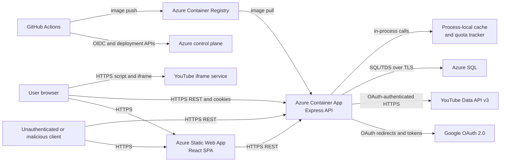

# Threat Model

## Status and purpose

This is the baseline threat model for Focused Tube. It documents the system's current
trust boundaries, protected assets, assumed adversaries, security controls, and known
residual risks.

This file is the canonical security-design reference for engineers, reviewers,
workflows, agents, and skills. Consumers should use it to determine whether a proposed
change moves a trust boundary. When a boundary moves, review the affected boundary and
propose the exact update needed here.

This model reflects the implemented application and its documented Azure deployment.
Where deployment behavior depends on external configuration, it is recorded as an
assumption rather than an implemented control.

## Scope

In scope:

- The React single-page application served by Azure Static Web Apps.
- The public Express REST API running in Azure Container Apps.
- Google OAuth 2.0 sign-in and stored Google credentials.
- YouTube Data API v3 requests made on behalf of users.
- JWT access and refresh sessions.
- Profile, channel, keyword, follow, and account data in Azure SQL.
- The in-memory API cache and YouTube quota tracker.
- The GitHub Actions deployment path to Azure Static Web Apps, Azure Container
  Registry, Azure Container Apps, and Azure SQL.
- The YouTube iframe loaded by the browser for video playback.

Out of scope:

- Security inside Google, YouTube, GitHub, and Azure managed services.
- User device compromise, malicious browser extensions, and compromised Google
  accounts.
- Availability guarantees from external providers.
- Queues, webhooks, administrative APIs, and background workers; none are currently
  part of the application.

## Security objectives

1. Only Google-authenticated users can access authenticated API operations.
2. A user can modify only profiles and profile contents that they own.
3. A non-owner can read a profile feed only when the profile is public and the user
   follows it.
4. Google access and refresh tokens remain confidential and are used only by the
   server for the user whose account supplied them.
5. JWT signing secrets, the token-encryption key, database credentials, and deployment
   credentials remain outside source control and untrusted clients.
6. Public profile sharing does not expose account credentials, private profiles, or
   unrelated user data.
7. Untrusted input cannot cause the server to contact arbitrary network destinations.
8. YouTube API use remains bounded enough to protect the shared quota and service
   availability.
9. Only reviewed and authorized GitHub Actions executions can deploy application code
   or database changes.

## System context

## Assets

| ID | Asset | Classification | Security requirement |
|---|---|---|---|
| A-01 | Google access and refresh tokens | Restricted PII / authentication secret | Never expose to the browser, logs, API responses, or other users; encrypt at rest |
| A-02 | JWT access and refresh tokens | Restricted PII / authentication secret | Prevent disclosure and forgery; scope cookies and token use to intended endpoints |
| A-03 | JWT signing secrets and token-encryption key | Restricted PII / authentication secret | Store only in approved secret stores; restrict to the API runtime |
| A-04 | Google OAuth client secret | Restricted PII / authentication secret | Restrict to the API runtime and deployment administrators |
| A-05 | User identity data: Google ID, email, name, avatar | Restricted PII for identifiers; otherwise confidential account data | Limit to the authenticated user and approved public profile fields |
| A-06 | Private profiles, channels, keywords, and follows | Confidential behavioral data | Enforce owner or explicitly permitted follower access |
| A-07 | Public profile name, owner display name/avatar, channels, and keywords | Public only after an owner opts in | Do not broaden the public projection without explicit product intent |
| A-08 | YouTube API quota and owner-authorized YouTube capability | Shared service and per-user capability | Prevent unauthorized use, uncontrolled amplification, and cross-user credential use |
| A-09 | Azure SQL contents and integrity | Confidential / Restricted PII | Permit access only from authorized application and migration identities |
| A-10 | Deployment credentials, OIDC trust, ACR credentials, and SWA token | Authentication secret | Restrict scope, prevent fork access, and protect deployment environments |
| A-11 | Application and dependency supply chain | Internal integrity asset | Build from reviewed source and locked dependencies; prevent unauthorized deployment |

Data classifications follow [`docs/data-classification.md`](data-classification.md).

## Actors and assumed adversaries

| Actor | Capability and intent |
|---|---|
| Unauthenticated internet client | Can call public API routes, start OAuth, submit malformed input, and attempt denial of service |
| Authenticated user | Has a valid account and can attempt to access or modify another user's data or consume shared quota |
| Follower of a public profile | Can request a followed profile's feed, causing the server to use the profile owner's stored Google credentials |
| Malicious content source | Controls YouTube metadata, thumbnails, identifiers, or API responses displayed or processed by the application |
| Supply-chain attacker | Attempts to introduce a malicious dependency, container base image, GitHub Action, or build artifact |
| Compromised CI identity | Can attempt to read deployment secrets, publish images, change Azure resources, or deploy altered code |
| Database reader | Can read Azure SQL data but is assumed not to possess the separately stored token-encryption key |
| Service operator | Has legitimate production access; accidental misuse and credential over-scoping are considered, but a fully malicious administrator is out of scope |

## Trust boundaries

### TB-01: Browser to static web application

The browser downloads JavaScript, styles, images, and routing configuration from Azure
Static Web Apps.

- **Data crossing:** Application bundles and static assets.
- **Assets exposed:** Client integrity and availability.
- **Current controls:** HTTPS is assumed; deployment uses the SWA deployment token;
  React escapes rendered text by default.
- **Boundary moves when:** A new script origin, analytics service, browser storage
  mechanism, service worker, content security policy, or static hosting provider is
  added or changed.

### TB-02: Browser or internet client to Express API

The API is externally reachable and accepts REST requests under `/api/*`.

- **Data crossing:** JSON bodies, path/query parameters, JWT bearer tokens, refresh
  cookies, user responses, and error responses.
- **Assets exposed:** Sessions, user data, profile data, YouTube capability, quota, and
  API availability.
- **Current controls:** CORS allows only `CLIENT_ORIGIN` and credentials; protected
  routes require a bearer JWT; JSON parsing uses Express defaults; Azure ingress is
  assumed to provide HTTPS.
- **Public entry points:** `GET /api/health`, `GET /api/ping`,
  `GET /api/auth/google`, `GET /api/auth/google/callback`,
  `POST /api/auth/refresh`, and `POST /api/auth/logout`.
- **Authenticated entry points:** `/api/auth/me`, `/api/profiles/*`,
  `/api/subscriptions`, `/api/feed/:profileId`, and `/api/community/*`.
- **Boundary moves when:** A route, HTTP method, port, accepted content type, cookie,
  header, token claim, request field, response field, CORS origin, or authentication
  requirement changes.

### TB-03: Authentication and session boundary

Google establishes user identity. The API converts that identity into application JWTs
and stores Google credentials for later YouTube calls.

- **Data crossing:** OAuth authorization responses, Google profile data, Google access
  and refresh tokens, JWT subject identifiers, and refresh cookies.
- **Assets exposed:** A-01 through A-05.
- **Current controls:** Passport handles Google OAuth; requested scopes are `profile`,
  `email`, and `youtube.readonly`; Google tokens are encrypted with AES-256-GCM before
  database storage; access JWTs expire after 15 minutes; refresh JWTs expire after 30
  days; refresh cookies are `httpOnly`, `Secure` in production, and scoped to
  `/api/auth`; access tokens are kept in browser memory and sent as bearer tokens.
- **Boundary moves when:** OAuth scopes, callback behavior, identity mapping, JWT claims
  or algorithms, token lifetime, cookie attributes, token storage, token refresh,
  logout, revocation, or signing/encryption keys change.

### TB-04: Authorization between profile owners, followers, and public data

The API separates each owner's private profile data from other users. A public profile
can be discovered and followed. A follower can then request that profile's feed.

- **Data crossing:** Profile identifiers, visibility, channels, keywords, owner display
  data, follow relationships, and feed results.
- **Assets exposed:** A-05 through A-08.
- **Current controls:** Profile mutations query by both profile ID and authenticated
  user ID or call `assertProfileOwnership`; public discovery filters on
  `isPublic: true`; following requires an existing public profile and rejects following
  one's own profile; a non-owner feed request requires both a follow relationship and
  the profile still being public.
- **Important delegated capability:** A permitted follower's feed request uses the
  profile owner's Google credentials and consumes the shared YouTube quota. The
  follower never receives those credentials.
- **Boundary moves when:** Ownership checks, public visibility, follow requirements,
  returned profile fields, feed eligibility, or the identity whose Google credentials
  are used changes.

### TB-05: Express API to Google OAuth and YouTube APIs

The server sends requests only to Google OAuth and YouTube endpoints through Google's
client libraries.

- **Data crossing:** OAuth client credentials, user OAuth tokens, subscription
  identifiers, channel IDs, keywords, page tokens, video IDs, and video metadata.
- **Assets exposed:** A-01, A-04, A-06, and A-08.
- **Current controls:** The server uses the `googleapis` and
  `google-auth-library` clients; the OAuth scope is read-only; outbound destinations
  are library-defined rather than user-provided URLs; API calls are isolated in the
  YouTube service; video ID lookups are batched in groups of 50; cache and quota guards
  reduce repeated requests.
- **Boundary moves when:** OAuth scopes, Google API methods, request parameters,
  outbound destinations, retry behavior, token-refresh behavior, batching, caching, or
  quota accounting changes.

### TB-06: Express API to Azure SQL

Prisma reads and writes persistent user, credential, profile, and follow records in
Azure SQL.

- **Data crossing:** A-01, A-05, A-06, encrypted token ciphertext, and relational
  identifiers.
- **Assets exposed:** A-01, A-05, A-06, and A-09.
- **Current controls:** Prisma parameterizes database operations; the production
  connection string requires encrypted transport; profile ownership is enforced before
  protected data access; Google tokens are encrypted before persistence; relational
  constraints and cascade behavior preserve data integrity.
- **Boundary moves when:** The schema, database provider, connection security,
  encryption format, credential storage, query authorization predicates, migrations,
  or database network access changes.

### TB-07: API process to runtime secrets and process-local state

The Container App supplies configuration and secrets to the Node.js process. The
process maintains an in-memory cache and quota counter.

- **Data crossing:** Environment variables, decrypted Google tokens, cached public
  video metadata, cached keyword results, and quota counters.
- **Assets exposed:** A-01, A-03, A-04, A-06, and A-08.
- **Current controls:** Required secrets fail closed at configuration access; secrets
  are not committed; the container runs as a non-root user; cache entries have TTL and
  LRU limits.
- **Boundary moves when:** A secret is added, renamed, logged, passed to another
  process, mounted as a file, broadened in scope, or made available to client code; the
  cache becomes shared or persistent; or process isolation changes.

### TB-08: GitHub Actions to Azure deployment services

The CI/CD workflow builds source and dependencies, publishes a server image to ACR,
updates the Container App, and deploys the SPA.

- **Data crossing:** Source code, dependency artifacts, container images, GitHub OIDC
  tokens, Azure identity assertions, ACR credentials, and the SWA deployment token.
- **Assets exposed:** A-09 through A-11.
- **Current controls:** Workflow-level permissions default to `contents: read`;
  deployment jobs request `id-token: write`; Azure login uses OIDC; jobs target a
  GitHub environment; the Docker runtime runs as non-root; the image is tagged with the
  commit SHA and `latest`.
- **Configuration-dependent controls:** Environment approvals, branch restrictions,
  Azure federated-credential subject restrictions, and Azure role scope must be
  enforced in GitHub and Azure settings.
- **Boundary moves when:** Workflow triggers, permissions, action references, secret
  availability, environment protection, Azure roles, registry authentication, image
  provenance, deployment targets, or migration execution changes.

### TB-09: Browser to YouTube playback

The client loads the YouTube iframe API from `www.youtube.com` and creates players using
`www.youtube-nocookie.com`.

- **Data crossing:** Browser IP and request metadata, application origin, selected video
  ID, playback events, and YouTube-delivered script/frame content.
- **Assets exposed:** User privacy, browser integrity, and client availability.
- **Current controls:** Video IDs originate from the YouTube API; external watch links
  use `noopener,noreferrer`; the player uses the privacy-enhanced host.
- **Boundary moves when:** Script or iframe origins, player parameters, referrer policy,
  video URL construction, third-party embeds, or external navigation behavior changes.

## Critical data flows

### Sign-in and session restoration

1. The browser requests `GET /api/auth/google`.
2. The API redirects the browser to Google with profile, email, and
   `youtube.readonly` scopes.
3. Google redirects to `/api/auth/google/callback`.
4. Passport maps the Google profile to a user and the API encrypts Google tokens before
   storing them in Azure SQL.
5. The API creates a 15-minute access JWT and a 30-day refresh JWT.
6. The refresh JWT is stored in an `httpOnly` cookie. A short-lived bootstrap access
   cookie is also set during callback handoff.
7. The SPA calls `POST /api/auth/refresh`, receives an access JWT, stores it only in
   memory, and sends it in the `Authorization` header.

### Owned profile access

1. The client sends a bearer JWT.
2. `authenticateJwt` verifies the signature and expiry and places the JWT subject in
   `req.user.id`.
3. Profile reads and writes constrain database access by both profile ID and user ID,
   or call `assertProfileOwnership`.
4. Only the selected user's data is returned or modified.

### Followed public-profile feed

1. An authenticated follower requests `GET /api/feed/:profileId`.
2. The API loads the profile and detects that the caller is not the owner.
3. The API requires an existing follow relationship and `isPublic: true`.
4. The API uses the profile owner's encrypted Google credentials to request YouTube
   data.
5. The follower receives video metadata, not the owner's Google credentials.

This flow intentionally delegates a narrow, read-only capability backed by the owner's
credentials. Any change that broadens returned data, removes either eligibility check,
uses broader Google scopes, or permits user-controlled Google requests moves TB-04 and
TB-05.

### Deployment

1. A manually dispatched GitHub Actions workflow checks out the repository, installs
   locked dependencies, builds, and tests it.
2. Deployment jobs authenticate to Azure or deployment services using OIDC and
   configured secrets.
3. The server image is built from `server/Dockerfile`, pushed to ACR, and selected by
   commit SHA for the Container App.
4. The built SPA is uploaded to Azure Static Web Apps.

## Security invariants

Changes must preserve these invariants unless this document is deliberately updated:

- Stored Google access and refresh tokens are never returned to clients, automated
  tooling, or other users.
- `ENCRYPTION_KEY`, JWT secrets, OAuth client secrets, database credentials, and
  deployment credentials never enter source control, logs, or client bundles.
- Access JWTs identify only the user subject and are verified before protected routes
  run.
- Profile mutation requires ownership.
- Non-owner feed access requires both an active follow relationship and a public
  profile.
- A follower cannot select arbitrary owner credentials or arbitrary outbound API
  requests.
- OAuth scopes remain read-only unless a reviewed feature explicitly requires more.
- User-controlled values do not become outbound URLs or network destinations.
- New external scripts, frames, APIs, registries, or deployment targets require a
  boundary review.
- Public API responses do not include encrypted token fields, credential material, or
  private profile data.
- Database encryption in transit and HTTPS termination remain enabled in production.
- CI jobs do not expose deployment credentials to pull requests or untrusted forks.

## Known residual risks and review priorities

These are existing conditions to consider when a related boundary changes. They are not
automatically findings in every pull request.

| Risk | Affected boundary | Existing mitigation | Residual concern |
|---|---|---|---|
| Refresh JWTs are stateless | TB-03 | Shorter access-token lifetime; refresh-token expiry and cookie scoping | Rotation and logout do not invalidate a previously copied refresh JWT before its expiry |
| Followers consume an owner's delegated YouTube capability | TB-04, TB-05 | Public opt-in, follow check, read-only OAuth scope, cache, quota guard | A malicious follower may repeatedly consume shared quota or trigger work under the owner's credentials |
| Quota tracking and caching are process-local | TB-05, TB-07 | Per-process LRU/TTL cache and soft quota limit | Multiple replicas or restarts can undercount aggregate quota and lose cached protection |
| No application-level rate limiter is documented | TB-02 | Azure platform controls and YouTube quota guard may limit some load | Public and authenticated endpoints may be abused for resource exhaustion |
| Refresh and logout use automatically attached cookies | TB-02, TB-03 | `httpOnly`, `Secure` in production, path scoping, and origin-restricted CORS | Cross-site request protections rely on cookie policy and deployment behavior; changes to `SameSite`, origins, or cookie endpoints need focused review |
| Generic server errors return `err.message` | TB-02 | Central error handler; stack traces are logged rather than returned | Dependency or database messages may disclose implementation details unless callers normalize them |
| Some deployment credentials are long-lived secrets | TB-08 | GitHub secret storage and environment scoping; Azure login uses OIDC | ACR admin credentials and the SWA deployment token have broader replay value if exposed |
| Third-party script executes in the browser | TB-09 | Fixed YouTube origin and privacy-enhanced iframe host | Compromise or unexpected behavior at the third-party origin affects client privacy and integrity |

## Deployment and operational assumptions

The following assumptions must be verified in the deployed environment:

- Azure terminates HTTPS for the Static Web App, Container App, and SQL connection.
- `CLIENT_ORIGIN` is the exact trusted SPA origin and is not a wildcard.
- Google OAuth redirect URIs exactly match the deployed callback URL.
- Azure Container App secrets are scoped to the API and are not exposed as build
  arguments or client environment variables.
- The GitHub deployment environment restricts deployment to trusted branches and uses
  required reviewers where appropriate.
- The Azure federated credential trusts only the intended repository, branch, and
  environment subjects.
- Azure roles granted to the deployment identity are limited to the required resource
  group and operations.
- ACR, Azure SQL firewall rules, and Container App ingress are no broader than required.
- Production logs and telemetry do not collect tokens, secrets, authorization headers,
  cookies, or restricted PII.

## Updating this model

A change moves a boundary when it:

- Adds an entry point, route, port, queue consumer, webhook, or externally callable
  operation.
- Changes who can call an operation or which checks run before it proceeds.
- Changes data in a token, cookie, header, request, response, event, or external call.
- Adds an external dependency, script origin, API, registry, or outbound destination.
- Changes secret storage, transport, visibility, lifetime, rotation, or scope.
- Weakens, removes, bypasses, or changes the failure mode of an existing control.

When updating this file:

1. Identify the affected boundary IDs.
2. Update the data crossing the boundary and the assets exposed.
3. Record the new or changed control and any residual risk.
4. Add or update the relevant critical data flow.
5. Keep assumptions separate from controls enforced by code.
6. Do not rewrite unrelated boundaries.
